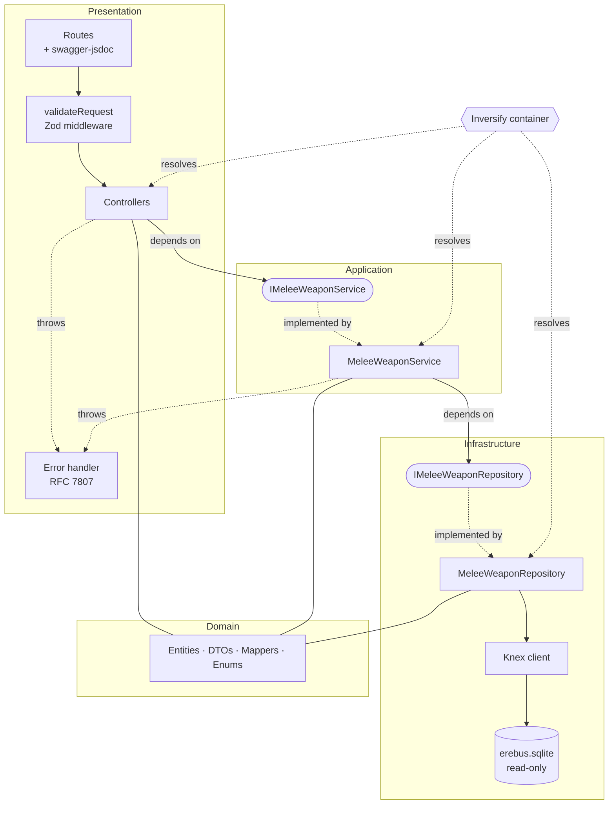
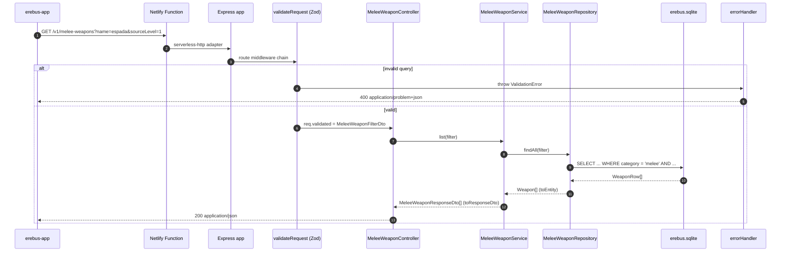

# LLD: erebus-api

**Version:** 1.0
**Date:** 2026-09-10
**Owner:** rattopedro@gmail.com
**Parent documents:** `docs/prd.md` (Phase 1 PRD), `erebus-api/docs/hld-erebus-api.md` (HLD v1.1)
**Status:** Normative — binding for all code written in `erebus-api`

---

## 0. How to read this document

This LLD is a **normative contract**, not a discussion. It is written to be executed
literally by AI agents (`javascript-developer`, `javascript-qa-engineer`, `tech-lead`)
and by humans writing code in `erebus-api`.

Rules of engagement:

- **MUST / MUST NOT** — non-negotiable. Code violating these is rejected in review.
- **SHOULD** — the default; deviation requires an explicit note in `PLAN.md`.
- **MAY** — free choice.
- Where this document and the HLD disagree, **this document wins for implementation
  detail**; the HLD wins for scope and architectural intent.
- Anything not covered here MUST follow the closest existing pattern in the codebase.
  If no pattern exists, stop and escalate to `tech-lead` — **do not invent a new one**.

Language rule: this document is written in English. **All code, identifiers, file
names, comments, JSDoc, commit messages, test descriptions and log messages MUST be
in English.** Domain data values (weapon names, skill names) stay in their source
language (Portuguese) because they are data, not code.

---

## 1. Architecture objective

Move `erebus-api` from an empty Express scaffold to a **read-only REST service** that
exposes Daemon System catalogue data (melee weapons, ranged weapons, firearms,
protections, skills, enhancements) from an embedded SQLite database, under Clean
Architecture, deployable as a Netlify Function and consumable by `erebus-app` today
and by `erebus-engine` (C++) in Phase 2.

The architecture MUST guarantee, in this order of priority:

1. **Layer isolation.** Each layer knows only the interface of the layer below.
   A change of database driver MUST NOT touch controllers or services.
2. **Testability without I/O.** Every service and controller MUST be unit-testable
   with zero database, zero network, zero filesystem.
3. **Contract stability.** HTTP contracts are versioned under `/v1` from day one, so
   Phase 2 can evolve them without breaking `erebus-app`.
4. **Provenance integrity.** Every entity exposed by the API MUST carry
   `sourceLevel` and `source`. No endpoint may return a record without provenance.
5. **Predictability for agents.** Adding a new entity MUST be a mechanical repetition
   of the reference slice in §7 — no design decisions required.

Explicit non-goals in this phase: write endpoints, authentication, caching in
application memory, multi-tenant concerns, rule execution logic (that is
`erebus-engine`).

---

## 2. Stack and dependencies

The dependency set is **closed**. Adding any runtime dependency not listed here
requires an ADR under `docs/decisions/` approved by `tech-lead`. Removing one
requires the same.

### 2.1 Runtime dependencies

| Package | Version range | Layer | Purpose |
| --- | --- | --- | --- |
| `express` | `^5.2.1` | Presentation | HTTP routing and middleware pipeline |
| `serverless-http` | `^3.2.0` | Infrastructure | Wraps the Express app as a Netlify Function handler |
| `knex` | `^3.1.0` | Infrastructure | Query builder — **the only** way to touch SQL |
| `better-sqlite3` | `^11.5.0` | Infrastructure | SQLite driver (synchronous, embedded, read-only here) |
| `inversify` | `^6.2.0` | Cross-cutting | Dependency injection container |
| `reflect-metadata` | `^0.2.2` | Cross-cutting | Required by Inversify decorators; imported **once**, first line of `src/app.ts` |
| `zod` | `^3.23.0` | Presentation | Query/param schema validation |
| `pino` | `^9.5.0` | Cross-cutting | Structured JSON logging |
| `pino-http` | `^10.3.0` | Presentation | Request/response log middleware |
| `swagger-jsdoc` | `^6.2.8` | Infrastructure | Builds the OpenAPI spec from route annotations |
| `swagger-ui-express` | `^5.0.1` | Presentation | Serves the Swagger UI at `/v1/docs` |

### 2.2 Development dependencies

| Package | Purpose |
| --- | --- |
| `typescript` (`^5.6.0`) | Compiler. **Note:** the current `package.json` pins `^7.0.2`, which does not exist — it MUST be corrected to `^5.6.0` in the first increment. |
| `tsx` | Runs TypeScript directly in development (`npm run dev`) |
| `tsup` | Bundles `src/` to `dist/` for the Netlify Function package |
| `vitest` | Test runner — unit and integration |
| `@vitest/coverage-v8` | Coverage reporting |
| `supertest` + `@types/supertest` | HTTP-level integration tests (QA layer only) |
| `eslint`, `@typescript-eslint/*`, `eslint-plugin-import` | Linting, import ordering, layer-boundary rules |
| `prettier` | Formatting |
| `@types/node`, `@types/express`, `@types/swagger-jsdoc`, `@types/swagger-ui-express` | Type definitions |

### 2.3 Forbidden dependencies

MUST NOT be added: any ORM (`typeorm`, `prisma`, `sequelize`, `drizzle`) — Knex is
the decided query layer; `axios`/`node-fetch` — this service makes no outbound HTTP
calls; `lodash` — use native ES2022; `moment`/`dayjs` — no date logic in this phase;
`dotenv` in production code — configuration is read from `process.env` through a
single typed config module (§13.4).

### 2.4 npm scripts (canonical)

```json
{
  "dev": "tsx watch src/server.ts",
  "build": "tsup",
  "start": "node dist/server.js",
  "test": "vitest run",
  "test:watch": "vitest",
  "test:coverage": "vitest run --coverage",
  "lint": "eslint . --max-warnings=0",
  "format": "prettier --write ."
}
```

---

## 3. Folder tree

Organisation is **by technical layer** (classic MVC vocabulary, Clean Architecture
boundaries). Every file name follows `<entity>.<role>.ts` in kebab-case.

```
erebus-api/
├─ docs/
│  ├─ hld-erebus-api.md            # high-level design (parent)
│  ├─ lld-erebus-api.md            # this document
│  └─ decisions/                   # ADRs
├─ netlify/
│  └─ functions/
│     └─ api.ts                    # serverless entrypoint (thin, see §13.1)
├─ src/
│  ├─ controllers/
│  │  ├─ melee-weapon.controller.ts
│  │  ├─ ranged-weapon.controller.ts
│  │  ├─ firearm.controller.ts
│  │  ├─ protection.controller.ts
│  │  ├─ skill.controller.ts
│  │  └─ enhancement.controller.ts
│  ├─ services/
│  │  ├─ interfaces/
│  │  │  ├─ melee-weapon.service.interface.ts
│  │  │  └─ ...                    # one interface file per service
│  │  ├─ melee-weapon.service.ts
│  │  └─ ...
│  ├─ repositories/
│  │  ├─ interfaces/
│  │  │  ├─ melee-weapon.repository.interface.ts
│  │  │  └─ ...
│  │  ├─ melee-weapon.repository.ts
│  │  └─ ...
│  ├─ models/
│  │  ├─ entities/                 # domain entities (camelCase, DB-agnostic)
│  │  │  ├─ weapon.entity.ts
│  │  │  ├─ protection.entity.ts
│  │  │  ├─ skill.entity.ts
│  │  │  └─ enhancement.entity.ts
│  │  ├─ dtos/                     # transport shapes (request filters + responses)
│  │  │  ├─ melee-weapon.dto.ts
│  │  │  └─ ...
│  │  ├─ rows/                     # raw snake_case row types returned by Knex
│  │  │  ├─ weapon.row.ts
│  │  │  └─ ...
│  │  ├─ mappers/                  # row → entity → DTO
│  │  │  ├─ weapon.mapper.ts
│  │  │  └─ ...
│  │  └─ enums/
│  │     ├─ weapon-category.enum.ts
│  │     └─ source-level.enum.ts
│  ├─ routes/
│  │  ├─ index.routes.ts           # mounts every entity router under /v1
│  │  ├─ melee-weapon.routes.ts    # route + swagger-jsdoc annotations
│  │  └─ ...
│  ├─ validation/
│  │  ├─ validate-request.middleware.ts
│  │  └─ schemas/
│  │     ├─ melee-weapon.schema.ts
│  │     └─ common.schema.ts       # id param, sourceLevel, name, pagination
│  ├─ middlewares/
│  │  ├─ error-handler.middleware.ts
│  │  ├─ not-found.middleware.ts
│  │  └─ request-logger.middleware.ts
│  ├─ errors/
│  │  ├─ app-error.ts              # abstract base
│  │  ├─ not-found.error.ts
│  │  └─ validation.error.ts
│  ├─ container/
│  │  ├─ types.ts                  # Symbol tokens (TYPES)
│  │  └─ container.ts              # bindings
│  ├─ infra/
│  │  ├─ database/
│  │  │  ├─ knexfile.ts
│  │  │  └─ knex-client.ts         # single Knex instance provider
│  │  ├─ logger/
│  │  │  └─ logger.ts              # pino instance
│  │  └─ swagger/
│  │     └─ swagger.ts             # swagger-jsdoc options + UI mount
│  ├─ config/
│  │  └─ env.ts                    # typed, validated environment access
│  ├─ app.ts                       # builds the Express app (no listen)
│  └─ server.ts                    # local entrypoint: app.listen
├─ tests/
│  ├─ integration/                 # QA engineer only — supertest + real SQLite
│  │  ├─ melee-weapon.routes.int.spec.ts
│  │  └─ helpers/
│  │     ├─ build-test-database.ts
│  │     └─ fixtures/
│  └─ setup.ts
├─ data/
│  └─ erebus.sqlite                # build artefact, gitignored, never edited by hand
├─ knexfile.ts                     # re-export of src/infra/database/knexfile.ts
├─ tsconfig.json
├─ tsup.config.ts
├─ vitest.config.ts
├─ eslint.config.js
└─ package.json
```

Structural rules:

- **Unit tests live next to the code** they test: `melee-weapon.service.spec.ts`
  sits beside `melee-weapon.service.ts`. Written by `javascript-developer` only.
- **Integration tests live in `tests/integration/`** and end in `.int.spec.ts`.
  Written by `javascript-qa-engineer` only.
- `src/app.ts` MUST NOT call `listen`. Only `src/server.ts` (local) and
  `netlify/functions/api.ts` (cloud) consume the app.
- A directory MUST NOT be created outside this tree without updating this document
  first.

---

## 4. Architecture

### 4.1 Layers and the dependency rule

Four layers. **Dependencies point inward and downward only, always through an
interface.** A layer MUST NOT import from the layer above it, ever.

| Layer | Directory | Knows about | MUST NOT know about |
| --- | --- | --- | --- |
| Presentation | `routes/`, `controllers/`, `middlewares/`, `validation/` | Service **interfaces**, DTOs, Express | Knex, SQL, repositories, row types |
| Application | `services/` | Repository **interfaces**, entities, DTOs, mappers, errors | Express (`Request`, `Response`, `next`), HTTP status codes, Knex |
| Infrastructure | `repositories/`, `infra/` | Knex, row types, entities, mappers | Services, controllers, Express |
| Domain | `models/` | Nothing | Everything |

Concretely:

- `import { Request } from 'express'` is **forbidden** in `src/services/**` and
  `src/repositories/**`.
- `import { Knex }` / `import knex` is **forbidden** outside `src/repositories/**`
  and `src/infra/database/**`.
- `src/models/**` MUST have zero imports from other `src/` directories except other
  files inside `src/models/**`.
- These rules are enforced mechanically by `eslint-plugin-import`
  (`import/no-restricted-paths`) — a violation fails `npm run lint`.

### 4.2 Object flow across boundaries

Four distinct shapes, never interchanged:

| Shape | Directory | Naming | Produced by | Consumed by |
| --- | --- | --- | --- | --- |
| **Row** | `models/rows/` | `WeaponRow` | Knex | Repository (only) |
| **Entity** | `models/entities/` | `Weapon` | Repository (via mapper) | Service |
| **Filter DTO** | `models/dtos/` | `MeleeWeaponFilterDto` | Controller (from Zod output) | Service → Repository |
| **Response DTO** | `models/dtos/` | `MeleeWeaponResponseDto` | Service (via mapper) | Controller → JSON |

Rules:

- A `Row` MUST NOT escape the repository. A repository method returning
  `Promise<WeaponRow[]>` is a defect.
- An `Entity` MUST NOT be serialised directly into a response. The service maps
  entity → response DTO.
- A controller MUST NOT construct an entity, and MUST NOT read a row property.
- Mapping functions live in `models/mappers/`, are pure, and are unit-tested.

### 4.3 Component diagram (Mermaid)



### 4.4 Component diagram (C4 level 3, PlantUML)

```plantuml
@startuml C4_Component_erebus_api
!include https://raw.githubusercontent.com/plantuml-stdlib/C4-PlantUML/master/C4_Component.puml

title Component diagram — erebus-api (C4 level 3)

Person(player, "Player / Game Master", "Consults Daemon System catalogue data")
System_Ext(app, "erebus-app", "React + Vite SPA (MVVM)")
System_Ext(engine, "erebus-engine", "C++ rules engine — Phase 2 consumer")

Container_Boundary(api, "erebus-api (Netlify Function)") {
    Component(fn, "Netlify Function adapter", "serverless-http", "Wraps the Express app as a serverless handler")
    Component(routes, "Routers", "Express Router + swagger-jsdoc", "Declares /v1 routes and OpenAPI annotations")
    Component(validation, "Request validation", "Zod middleware", "Validates params and query, produces filter DTOs")
    Component(controllers, "Controllers", "TypeScript + Inversify", "Adapts HTTP to service calls, serialises response DTOs")
    Component(services, "Services", "TypeScript + Inversify", "Application rules, orchestration, entity to DTO mapping")
    Component(repositories, "Repositories", "TypeScript + Knex", "Sole SQL access point, maps rows to entities")
    Component(models, "Domain models", "TypeScript", "Entities, DTOs, enums, pure mappers")
    Component(errors, "Error handler", "Express middleware", "Emits RFC 7807 Problem Details")
    Component(swagger, "Swagger UI", "swagger-ui-express", "Serves the OpenAPI documentation")
    Component(logger, "Logger", "pino", "Structured JSON logs")
}

ContainerDb_Ext(db, "erebus.sqlite", "SQLite (better-sqlite3)", "Read-only artefact embedded in the function bundle")

Rel(player, app, "Uses", "HTTPS")
Rel(app, fn, "GET /v1/...", "REST/JSON")
Rel(engine, fn, "GET /v1/... (Phase 2)", "REST/JSON")
Rel(fn, routes, "Forwards request")
Rel(routes, validation, "Runs before controller")
Rel(validation, controllers, "Passes validated filter DTO")
Rel(controllers, services, "Calls via interface")
Rel(services, repositories, "Calls via interface")
Rel(repositories, db, "SELECT via Knex")
Rel(controllers, errors, "Delegates thrown errors")
Rel(services, errors, "Throws domain errors")
Rel(routes, swagger, "Feeds annotations")
Rel(fn, logger, "Emits request logs")
Rel_Neighbor(models, services, "Shared types")

@enduml
```

### 4.5 Request sequence (Mermaid)



Detail endpoint divergence: when `findById` returns `null`, the **service** throws
`NotFoundError` (never the repository, never the controller). The error handler
translates it into `404 application/problem+json`.

---

## 5. HTTP contract

### 5.1 Route table

All routes are mounted under the `/v1` prefix and are `GET`-only.

| Method | Path | Query parameters | Success |
| --- | --- | --- | --- |
| GET | `/v1/melee-weapons` | `name?`, `sourceLevel?`, `skillGroup?` | `200` `MeleeWeaponResponseDto[]` |
| GET | `/v1/melee-weapons/:id` | — | `200` `MeleeWeaponResponseDto` |
| GET | `/v1/ranged-weapons` | `name?`, `sourceLevel?`, `skillGroup?` | `200` `RangedWeaponResponseDto[]` |
| GET | `/v1/ranged-weapons/:id` | — | `200` `RangedWeaponResponseDto` |
| GET | `/v1/firearms` | `name?`, `sourceLevel?`, `ammunition?` | `200` `FirearmResponseDto[]` |
| GET | `/v1/firearms/:id` | — | `200` `FirearmResponseDto` |
| GET | `/v1/protections` | `name?`, `sourceLevel?`, `kind?` | `200` `ProtectionResponseDto[]` |
| GET | `/v1/protections/:id` | — | `200` `ProtectionResponseDto` |
| GET | `/v1/skills` | `name?`, `sourceLevel?`, `baseAttribute?`, `rootOnly?` | `200` `SkillResponseDto[]` |
| GET | `/v1/skills/:id` | — | `200` `SkillDetailResponseDto` (includes `subgroups[]`) |
| GET | `/v1/enhancements` | `name?`, `sourceLevel?`, `minCost?`, `maxCost?` | `200` `EnhancementResponseDto[]` |
| GET | `/v1/enhancements/:id` | — | `200` `EnhancementDetailResponseDto` (includes `levels[]`) |
| GET | `/v1/health` | — | `200` `{ status, version, uptimeMs }` |
| GET | `/v1/docs` | — | `200` Swagger UI (HTML) |

`GET /v1/ranged-weapons` is a **product-facing view** over
`category = 'ranged' OR isThrown = true`, per HLD ADR-001. Its OpenAPI description
MUST carry the note that bows and crossbows are canonically *armas brancas* in the
Daemon System, and every weapon DTO MUST return `skillGroup`.

### 5.2 Success responses

Success payloads are **raw** — no envelope. A list returns a JSON array; a detail
returns a JSON object. Pagination is out of scope in this phase (the dataset is a
few hundred rows); do not add `limit`/`offset` without an ADR.

### 5.3 Error responses — RFC 7807 Problem Details

Every error response MUST have `Content-Type: application/problem+json` and this
body shape:

```json
{
  "type": "https://erebus.dev/problems/not-found",
  "title": "Resource not found",
  "status": 404,
  "detail": "Melee weapon with id 999 was not found.",
  "instance": "/v1/melee-weapons/999"
}
```

Validation errors add a non-standard `errors` array:

```json
{
  "type": "https://erebus.dev/problems/validation-error",
  "title": "Invalid request parameters",
  "status": 400,
  "detail": "One or more request parameters are invalid.",
  "instance": "/v1/melee-weapons",
  "errors": [
    { "field": "sourceLevel", "message": "Expected an integer between 1 and 3." }
  ]
}
```

| HTTP | `type` slug | Thrown by | When |
| --- | --- | --- | --- |
| 400 | `validation-error` | `validateRequest` middleware | Zod parse failure on params/query |
| 404 | `not-found` | Service | `findById` returned `null`; unmatched route |
| 500 | `internal-error` | Error handler (fallback) | Any unexpected throw |

`500` responses MUST NOT leak `error.message` or stack traces to the client — the
handler logs the full error via pino and returns a generic `detail`.

---

## 6. Data models

### 6.1 Naming convention

- **Database:** `snake_case` table and column names, plural table names.
- **TypeScript:** `camelCase` properties, `PascalCase` types.
- The **repository is the only place** where the two vocabularies meet, and it does
  so exclusively through a mapper in `models/mappers/`. No other file may reference
  a snake_case identifier.

### 6.2 Common provenance columns

Every entity table MUST carry these three columns. They are non-negotiable (PRD
§3, HLD risk "Level 2/3 data confused with canonical rule"):

| Column | Type | Null | Notes |
| --- | --- | --- | --- |
| `source_level` | `integer` | NOT NULL | `1` canonical, `2` official, `3` curated community. `CHECK (source_level IN (1,2,3))` — level 4 MUST NOT exist in the database |
| `source` | `text` | NOT NULL | Citation: file+field, manual section, netbook, or URL |
| `edition_or_version` | `text` | NULL | e.g. `"Manual Básico 1.04 (dez/2022)"` |

Exposed on every response DTO as `sourceLevel`, `source`, `editionOrVersion`.

### 6.3 Schema DDL (Knex)

Table `weapons` — single table, discriminated by `category` (HLD ADR-001):

```ts
await knex.schema.createTable('weapons', (table) => {
  table.increments('id').primary();
  table.text('name').notNullable();
  table.text('category').notNullable();          // 'melee' | 'ranged' | 'firearm'
  table.boolean('is_thrown').notNullable().defaultTo(false);
  table.integer('skill_id').notNullable().references('id').inTable('skills');
  table.text('skill_group').notNullable();       // denormalised canonical skill name
  table.text('damage').notNullable();            // dice expression, e.g. '1d6+2'
  table.integer('initiative').nullable();        // melee/ranged only
  table.integer('normal_range_m').nullable();
  table.integer('max_range_m').nullable();
  table.text('ammunition').nullable();           // firearm only
  table.integer('magazine_size').nullable();     // firearm only
  table.text('magazine_type').nullable();        // firearm only
  table.integer('rate_of_fire').nullable();      // firearm only
  table.float('weight_kg').nullable();
  table.float('price_usd').nullable();
  table.text('notes').nullable();
  table.integer('source_level').notNullable();
  table.text('source').notNullable();
  table.text('edition_or_version').nullable();

  table.unique(['name', 'category']);
  table.index(['category']);
  table.index(['name']);
  table.index(['source_level']);
  table.check("category IN ('melee','ranged','firearm')");
  table.check('source_level IN (1,2,3)');
});
```

Table `protections`:

```ts
await knex.schema.createTable('protections', (table) => {
  table.increments('id').primary();
  table.text('name').notNullable();
  table.text('kind').notNullable();              // 'armor' | 'vest' | 'specific' | 'cover'
  table.integer('armor_points').nullable();      // ip
  table.integer('kinetic_armor_points').nullable();
  table.integer('ballistic_armor_points').nullable();
  table.integer('additional_armor_points').nullable();
  table.text('protects_against').nullable();     // 'fogo', 'ácido', ...
  table.integer('dexterity_penalty').notNullable().defaultTo(0);
  table.integer('agility_penalty').notNullable().defaultTo(0);
  table.integer('source_level').notNullable();
  table.text('source').notNullable();
  table.text('edition_or_version').nullable();

  table.unique(['name', 'kind']);
  table.index(['kind']);
  table.index(['name']);
  table.check("kind IN ('armor','vest','specific','cover')");
  table.check('source_level IN (1,2,3)');
});
```

Table `skills` — self-referencing group → subgroup hierarchy:

```ts
await knex.schema.createTable('skills', (table) => {
  table.increments('id').primary();
  table.text('name').notNullable();
  table.integer('parent_skill_id').nullable().references('id').inTable('skills');
  table.boolean('has_subgroups').notNullable().defaultTo(false);
  table.text('base_attribute').nullable();       // 'AGI'|'CAR'|'CON'|'DEX'|'FR'|'INT'|'PER'|'WILL'
  table.text('initial_value_type').nullable();   // 'instinctive'|'technical'|'related'
  table.text('category').nullable();             // only meaningful for 'Condução'
  table.text('prerequisite').nullable();
  table.text('damage').nullable();               // unarmed combat skills
  table.text('notes').nullable();
  table.integer('source_level').notNullable();
  table.text('source').notNullable();
  table.text('edition_or_version').nullable();

  table.unique(['parent_skill_id', 'name']);     // names repeat ACROSS groups
  table.index(['parent_skill_id']);
  table.index(['name']);
  table.check('source_level IN (1,2,3)');
});
```

Modelling rules for `skills`, derived from the Daemon System (game-designer report,
2026-09-09) — these are **domain invariants, not preferences**:

1. Hierarchy is 1:N (group → subgroups), never N:N. A subgroup has exactly one parent.
2. A group with subgroups is **not purchasable**; only a leaf is. `has_subgroups`
   MUST be exposed so consumers can render this.
3. `base_attribute` resolves as `subgroup.base_attribute ?? parent.base_attribute`.
   That resolution happens in the **service**, and the DTO exposes the resolved
   value as `effectiveBaseAttribute` alongside the raw `baseAttribute`.
4. Uniqueness is `(parent_skill_id, name)` — **never** `name` alone.

Tables `enhancements` and `enhancement_levels` (1:N):

```ts
await knex.schema.createTable('enhancements', (table) => {
  table.increments('id').primary();
  table.text('name').notNullable().unique();
  table.text('description').nullable();
  table.text('general_effect').nullable();
  table.text('restriction').nullable();
  table.text('prerequisite_for').nullable();
  table.text('notes').nullable();
  table.integer('source_level').notNullable();
  table.text('source').notNullable();
  table.text('edition_or_version').nullable();

  table.index(['name']);
  table.check('source_level IN (1,2,3)');
});

await knex.schema.createTable('enhancement_levels', (table) => {
  table.increments('id').primary();
  table.integer('enhancement_id').notNullable()
    .references('id').inTable('enhancements').onDelete('CASCADE');
  table.integer('level').notNullable();
  table.integer('cost').notNullable();
  table.text('effect').notNullable();

  table.unique(['enhancement_id', 'level']);
  table.index(['cost']);
});
```

Filtering enhancements by cost range operates on `enhancement_levels.cost` via a
join, returning the parent enhancement distinctly.

### 6.4 Entity, row and DTO — side by side

```ts
// src/models/rows/weapon.row.ts — mirrors the table exactly, snake_case
export interface WeaponRow {
  id: number;
  name: string;
  category: string;
  is_thrown: 0 | 1;              // SQLite has no boolean
  skill_id: number;
  skill_group: string;
  damage: string;
  initiative: number | null;
  normal_range_m: number | null;
  max_range_m: number | null;
  weight_kg: number | null;
  price_usd: number | null;
  notes: string | null;
  source_level: number;
  source: string;
  edition_or_version: string | null;
}
```

```ts
// src/models/entities/weapon.entity.ts — domain shape, camelCase, DB-agnostic
import { WeaponCategory } from '../enums/weapon-category.enum';
import { SourceLevel } from '../enums/source-level.enum';

export interface Provenance {
  sourceLevel: SourceLevel;
  source: string;
  editionOrVersion: string | null;
}

export interface Weapon extends Provenance {
  id: number;
  name: string;
  category: WeaponCategory;
  isThrown: boolean;
  skillId: number;
  skillGroup: string;
  damage: string;
  initiative: number | null;
  normalRangeM: number | null;
  maxRangeM: number | null;
  weightKg: number | null;
  priceUsd: number | null;
  notes: string | null;
}
```

```ts
// src/models/dtos/melee-weapon.dto.ts — transport shapes
import { SourceLevel } from '../enums/source-level.enum';

/** Validated query filter produced by the Zod middleware. */
export interface MeleeWeaponFilterDto {
  name?: string;
  sourceLevel?: SourceLevel;
  skillGroup?: string;
}

/** Response shape for melee weapon list and detail endpoints. */
export interface MeleeWeaponResponseDto {
  id: number;
  name: string;
  damage: string;
  initiative: number | null;
  skillGroup: string;
  sourceLevel: SourceLevel;
  source: string;
  editionOrVersion: string | null;
}
```

Note what the response DTO **omits**: `skillId` (an internal foreign key),
`category` and `isThrown` (implied by the endpoint). A DTO is a deliberate
projection, never a copy of the entity.

### 6.5 Enums

```ts
// src/models/enums/weapon-category.enum.ts
export const WeaponCategory = {
  Melee: 'melee',
  Ranged: 'ranged',
  Firearm: 'firearm',
} as const;
export type WeaponCategory = (typeof WeaponCategory)[keyof typeof WeaponCategory];
```

Use `as const` object + derived union type. TypeScript `enum` MUST NOT be used —
it emits runtime code and does not narrow well against database strings.

### 6.6 Migrations and seed

Deliberately **not specified in this LLD**. The schema DDL above is normative for
column names, types and constraints; the migration file layout, the seed pipeline
from `docs/sistema daemon/data/*.json`, and the Level 2/3 curation file format are
specified in a separate document owned by `tech-lead` before the data increment
starts. Until then: SQLite is a **derived, disposable artefact** — never commit
`data/erebus.sqlite`, never hand-edit it, never treat it as a source of truth.

---

## 7. Reference implementation — the melee weapon vertical slice

This is the **template**. Adding an entity means repeating these eight files with
names substituted. Deviating from this shape requires an ADR.

### 7.1 Repository interface

```ts
// src/repositories/interfaces/melee-weapon.repository.interface.ts
import { Weapon } from '../../models/entities/weapon.entity';
import { MeleeWeaponFilterDto } from '../../models/dtos/melee-weapon.dto';

/**
 * Read-only data access contract for melee weapons.
 * Implementations are the sole SQL access point for this entity.
 */
export interface IMeleeWeaponRepository {
  /**
   * Finds every melee weapon matching the given filter.
   * @param filter Optional narrowing criteria.
   * @returns Matching weapons, empty array when none match.
   */
  findAll(filter: MeleeWeaponFilterDto): Promise<Weapon[]>;

  /**
   * Finds a single melee weapon by its identifier.
   * @param id Weapon identifier.
   * @returns The weapon, or null when no melee weapon has that id.
   */
  findById(id: number): Promise<Weapon | null>;
}
```

### 7.2 Repository implementation

```ts
// src/repositories/melee-weapon.repository.ts
import { inject, injectable } from 'inversify';
import type { Knex } from 'knex';
import { TYPES } from '../container/types';
import { IMeleeWeaponRepository } from './interfaces/melee-weapon.repository.interface';
import { Weapon } from '../models/entities/weapon.entity';
import { WeaponRow } from '../models/rows/weapon.row';
import { MeleeWeaponFilterDto } from '../models/dtos/melee-weapon.dto';
import { toWeaponEntity } from '../models/mappers/weapon.mapper';
import { WeaponCategory } from '../models/enums/weapon-category.enum';

@injectable()
export class MeleeWeaponRepository implements IMeleeWeaponRepository {
  private static readonly TABLE = 'weapons';

  constructor(@inject(TYPES.Knex) private readonly knex: Knex) {}

  public async findAll(filter: MeleeWeaponFilterDto): Promise<Weapon[]> {
    const query = this.knex<WeaponRow>(MeleeWeaponRepository.TABLE)
      .where('category', WeaponCategory.Melee);

    if (filter.name !== undefined) {
      query.whereLike('name', `%${filter.name}%`);
    }
    if (filter.sourceLevel !== undefined) {
      query.where('source_level', filter.sourceLevel);
    }
    if (filter.skillGroup !== undefined) {
      query.where('skill_group', filter.skillGroup);
    }

    const rows = await query.orderBy('name', 'asc');
    return rows.map(toWeaponEntity);
  }

  public async findById(id: number): Promise<Weapon | null> {
    const row = await this.knex<WeaponRow>(MeleeWeaponRepository.TABLE)
      .where({ id, category: WeaponCategory.Melee })
      .first();

    return row ? toWeaponEntity(row) : null;
  }
}
```

Repository rules: never throw HTTP-flavoured errors; return `null`, not a thrown
`NotFoundError`. Never build SQL by string concatenation — Knex bindings only.
Never `select('*')` implicitly relied upon for shape; the `Row` type is the contract.

### 7.3 Mapper

```ts
// src/models/mappers/weapon.mapper.ts
import { Weapon } from '../entities/weapon.entity';
import { WeaponRow } from '../rows/weapon.row';
import { WeaponCategory } from '../enums/weapon-category.enum';
import { SourceLevel } from '../enums/source-level.enum';
import { MeleeWeaponResponseDto } from '../dtos/melee-weapon.dto';

/**
 * Maps a raw database row to a domain weapon entity.
 * @param row Row as returned by Knex.
 */
export function toWeaponEntity(row: WeaponRow): Weapon {
  return {
    id: row.id,
    name: row.name,
    category: row.category as WeaponCategory,
    isThrown: row.is_thrown === 1,
    skillId: row.skill_id,
    skillGroup: row.skill_group,
    damage: row.damage,
    initiative: row.initiative,
    normalRangeM: row.normal_range_m,
    maxRangeM: row.max_range_m,
    weightKg: row.weight_kg,
    priceUsd: row.price_usd,
    notes: row.notes,
    sourceLevel: row.source_level as SourceLevel,
    source: row.source,
    editionOrVersion: row.edition_or_version,
  };
}

/**
 * Projects a weapon entity onto the melee weapon transport shape.
 * @param weapon Domain entity.
 */
export function toMeleeWeaponResponseDto(weapon: Weapon): MeleeWeaponResponseDto {
  return {
    id: weapon.id,
    name: weapon.name,
    damage: weapon.damage,
    initiative: weapon.initiative,
    skillGroup: weapon.skillGroup,
    sourceLevel: weapon.sourceLevel,
    source: weapon.source,
    editionOrVersion: weapon.editionOrVersion,
  };
}
```

### 7.4 Service interface and implementation

```ts
// src/services/interfaces/melee-weapon.service.interface.ts
import {
  MeleeWeaponFilterDto,
  MeleeWeaponResponseDto,
} from '../../models/dtos/melee-weapon.dto';

/** Application rules for the melee weapon catalogue. */
export interface IMeleeWeaponService {
  /**
   * Lists melee weapons matching the filter.
   * @param filter Validated narrowing criteria.
   */
  list(filter: MeleeWeaponFilterDto): Promise<MeleeWeaponResponseDto[]>;

  /**
   * Retrieves a single melee weapon.
   * @param id Weapon identifier.
   * @throws NotFoundError When no melee weapon has that id.
   */
  getById(id: number): Promise<MeleeWeaponResponseDto>;
}
```

```ts
// src/services/melee-weapon.service.ts
import { inject, injectable } from 'inversify';
import { TYPES } from '../container/types';
import { IMeleeWeaponService } from './interfaces/melee-weapon.service.interface';
import { IMeleeWeaponRepository } from '../repositories/interfaces/melee-weapon.repository.interface';
import {
  MeleeWeaponFilterDto,
  MeleeWeaponResponseDto,
} from '../models/dtos/melee-weapon.dto';
import { toMeleeWeaponResponseDto } from '../models/mappers/weapon.mapper';
import { NotFoundError } from '../errors/not-found.error';

@injectable()
export class MeleeWeaponService implements IMeleeWeaponService {
  constructor(
    @inject(TYPES.MeleeWeaponRepository)
    private readonly repository: IMeleeWeaponRepository,
  ) {}

  public async list(filter: MeleeWeaponFilterDto): Promise<MeleeWeaponResponseDto[]> {
    const weapons = await this.repository.findAll(filter);
    return weapons.map(toMeleeWeaponResponseDto);
  }

  public async getById(id: number): Promise<MeleeWeaponResponseDto> {
    const weapon = await this.repository.findById(id);

    if (weapon === null) {
      throw new NotFoundError(`Melee weapon with id ${id} was not found.`);
    }

    return toMeleeWeaponResponseDto(weapon);
  }
}
```

### 7.5 Errors

```ts
// src/errors/app-error.ts
/** Base class for every error that maps deterministically to an HTTP status. */
export abstract class AppError extends Error {
  public abstract readonly status: number;
  public abstract readonly problemType: string;
  public abstract readonly title: string;

  protected constructor(message: string) {
    super(message);
    this.name = new.target.name;
    Error.captureStackTrace?.(this, new.target);
  }
}
```

```ts
// src/errors/not-found.error.ts
import { AppError } from './app-error';

/** Raised when a requested resource does not exist. */
export class NotFoundError extends AppError {
  public readonly status = 404;
  public readonly problemType = 'https://erebus.dev/problems/not-found';
  public readonly title = 'Resource not found';

  public constructor(message: string) {
    super(message);
  }
}
```

### 7.6 Validation schema and middleware

```ts
// src/validation/schemas/common.schema.ts
import { z } from 'zod';

export const idParamSchema = z.object({
  id: z.coerce.number().int().positive(),
});

export const sourceLevelSchema = z.coerce.number().int().min(1).max(3).optional();

export const nameSchema = z.string().trim().min(1).max(120).optional();
```

```ts
// src/validation/schemas/melee-weapon.schema.ts
import { z } from 'zod';
import { nameSchema, sourceLevelSchema } from './common.schema';

export const meleeWeaponListQuerySchema = z.object({
  name: nameSchema,
  sourceLevel: sourceLevelSchema,
  skillGroup: z.string().trim().min(1).max(120).optional(),
}).strict();
```

```ts
// src/validation/validate-request.middleware.ts
import { NextFunction, Request, RequestHandler, Response } from 'express';
import { ZodSchema } from 'zod';
import { ValidationError } from '../errors/validation.error';

type RequestPart = 'params' | 'query' | 'body';

/**
 * Builds a middleware that validates one part of the request against a schema
 * and stores the parsed result on `res.locals.validated`.
 * @param part Request section to validate.
 * @param schema Zod schema describing the expected shape.
 */
export function validateRequest(part: RequestPart, schema: ZodSchema): RequestHandler {
  return (req: Request, res: Response, next: NextFunction): void => {
    const result = schema.safeParse(req[part]);

    if (!result.success) {
      next(
        new ValidationError(
          result.error.issues.map((issue) => ({
            field: issue.path.join('.'),
            message: issue.message,
          })),
        ),
      );
      return;
    }

    res.locals.validated = { ...res.locals.validated, ...result.data };
    next();
  };
}
```

Validated data is written to `res.locals.validated` rather than mutating `req.query`,
which is a getter in Express 5.

### 7.7 Controller

```ts
// src/controllers/melee-weapon.controller.ts
import { NextFunction, Request, Response } from 'express';
import { inject, injectable } from 'inversify';
import { TYPES } from '../container/types';
import { IMeleeWeaponService } from '../services/interfaces/melee-weapon.service.interface';
import { MeleeWeaponFilterDto } from '../models/dtos/melee-weapon.dto';

@injectable()
export class MeleeWeaponController {
  constructor(
    @inject(TYPES.MeleeWeaponService)
    private readonly service: IMeleeWeaponService,
  ) {}

  public list = async (
    _req: Request,
    res: Response,
    next: NextFunction,
  ): Promise<void> => {
    try {
      const filter = res.locals.validated as MeleeWeaponFilterDto;
      const weapons = await this.service.list(filter);
      res.status(200).json(weapons);
    } catch (error) {
      next(error);
    }
  };

  public getById = async (
    _req: Request,
    res: Response,
    next: NextFunction,
  ): Promise<void> => {
    try {
      const { id } = res.locals.validated as { id: number };
      const weapon = await this.service.getById(id);
      res.status(200).json(weapon);
    } catch (error) {
      next(error);
    }
  };
}
```

Handlers are **arrow-function properties**, so `this` stays bound when Express
invokes them. Every handler wraps its body in `try/catch` and delegates to `next`.

### 7.8 Routes with OpenAPI annotations

```ts
// src/routes/melee-weapon.routes.ts
import { Router } from 'express';
import { container } from '../container/container';
import { TYPES } from '../container/types';
import { MeleeWeaponController } from '../controllers/melee-weapon.controller';
import { validateRequest } from '../validation/validate-request.middleware';
import { idParamSchema } from '../validation/schemas/common.schema';
import { meleeWeaponListQuerySchema } from '../validation/schemas/melee-weapon.schema';

const router = Router();
const controller = container.get<MeleeWeaponController>(TYPES.MeleeWeaponController);

/**
 * @openapi
 * /v1/melee-weapons:
 *   get:
 *     tags: [Melee weapons]
 *     summary: Lists melee weapons
 *     parameters:
 *       - in: query
 *         name: name
 *         schema: { type: string }
 *         description: Partial, case-insensitive name match.
 *       - in: query
 *         name: sourceLevel
 *         schema: { type: integer, minimum: 1, maximum: 3 }
 *         description: 1 canonical, 2 official, 3 curated community.
 *     responses:
 *       200:
 *         description: Matching melee weapons.
 *       400:
 *         description: Invalid query parameters (RFC 7807).
 */
router.get(
  '/',
  validateRequest('query', meleeWeaponListQuerySchema),
  controller.list,
);

/**
 * @openapi
 * /v1/melee-weapons/{id}:
 *   get:
 *     tags: [Melee weapons]
 *     summary: Retrieves a melee weapon by id
 *     parameters:
 *       - in: path
 *         name: id
 *         required: true
 *         schema: { type: integer, minimum: 1 }
 *     responses:
 *       200: { description: The melee weapon. }
 *       404: { description: Not found (RFC 7807). }
 */
router.get(
  '/:id',
  validateRequest('params', idParamSchema),
  controller.getById,
);

export const meleeWeaponRoutes = router;
```

### 7.9 Error handler middleware

```ts
// src/middlewares/error-handler.middleware.ts
import { NextFunction, Request, Response } from 'express';
import { AppError } from '../errors/app-error';
import { ValidationError } from '../errors/validation.error';
import { logger } from '../infra/logger/logger';

/** Translates any thrown error into an RFC 7807 Problem Details response. */
export function errorHandler(
  error: unknown,
  req: Request,
  res: Response,
  _next: NextFunction,
): void {
  if (error instanceof AppError) {
    const body: Record<string, unknown> = {
      type: error.problemType,
      title: error.title,
      status: error.status,
      detail: error.message,
      instance: req.originalUrl,
    };

    if (error instanceof ValidationError) {
      body.errors = error.issues;
    }

    res.status(error.status).type('application/problem+json').json(body);
    return;
  }

  logger.error({ err: error, url: req.originalUrl }, 'Unhandled error');

  res.status(500).type('application/problem+json').json({
    type: 'https://erebus.dev/problems/internal-error',
    title: 'Internal server error',
    status: 500,
    detail: 'An unexpected error occurred.',
    instance: req.originalUrl,
  });
}
```

### 7.10 Application assembly

```ts
// src/app.ts
import 'reflect-metadata';
import express, { Express } from 'express';
import { registerRoutes } from './routes/index.routes';
import { errorHandler } from './middlewares/error-handler.middleware';
import { notFoundHandler } from './middlewares/not-found.middleware';
import { requestLogger } from './middlewares/request-logger.middleware';
import { mountSwagger } from './infra/swagger/swagger';

/** Builds the Express application without binding it to a port. */
export function createApp(): Express {
  const app = express();

  app.disable('x-powered-by');
  app.use(express.json());
  app.use(requestLogger);

  mountSwagger(app);
  registerRoutes(app);

  app.use(notFoundHandler);
  app.use(errorHandler);

  return app;
}
```

Middleware order is normative: logger → swagger → routes → 404 → error handler.
The error handler MUST be registered last and MUST keep its four-parameter
signature, otherwise Express does not recognise it.

---

## 8. Anti-patterns

Each ❌ below has been observed in Express/TypeScript codebases and is **rejected**
in `erebus-api`.

### 8.1 Database access outside the repository

```ts
// ❌ WRONG — controller talks to Knex; layers collapse, untestable without a database
router.get('/', async (req, res) => {
  const rows = await knex('weapons').where('category', 'melee');
  res.json(rows);
});
```

```ts
// ✅ RIGHT — controller depends on a service interface; SQL lives in the repository
router.get('/', validateRequest('query', meleeWeaponListQuerySchema), controller.list);
```

### 8.2 Express types leaking into the service

```ts
// ❌ WRONG — service knows about HTTP; it can no longer be reused by another transport
public async list(req: Request, res: Response): Promise<void> {
  const weapons = await this.repository.findAll(req.query);
  res.json(weapons);
}
```

```ts
// ✅ RIGHT — service speaks DTOs and returns values; the controller owns HTTP
public async list(filter: MeleeWeaponFilterDto): Promise<MeleeWeaponResponseDto[]> {
  const weapons = await this.repository.findAll(filter);
  return weapons.map(toMeleeWeaponResponseDto);
}
```

### 8.3 Depending on a concrete class instead of its interface

```ts
// ❌ WRONG — the service is welded to one implementation; the unit test needs a real Knex
constructor(private readonly repository: MeleeWeaponRepository) {}
```

```ts
// ✅ RIGHT — inverted dependency, trivially substitutable in tests
constructor(
  @inject(TYPES.MeleeWeaponRepository)
  private readonly repository: IMeleeWeaponRepository,
) {}
```

### 8.4 Leaking database rows to the client

```ts
// ❌ WRONG — snake_case, internal FKs and 0/1 booleans reach the API consumer
const rows = await this.knex('weapons').where('category', 'melee');
return rows; // { source_level: 1, is_thrown: 0, skill_id: 7, ... }
```

```ts
// ✅ RIGHT — row → entity → DTO, each boundary crossed explicitly
const rows = await query.orderBy('name', 'asc');
return rows.map(toWeaponEntity); // repository
// ... service: weapons.map(toMeleeWeaponResponseDto)
```

### 8.5 Ad-hoc error responses

```ts
// ❌ WRONG — three shapes of error in three controllers; the client cannot handle them
if (!weapon) return res.status(404).json({ msg: 'not found' });
if (!weapon) return res.status(404).send('Weapon not found');
if (!weapon) throw new Error('404');
```

```ts
// ✅ RIGHT — one domain error, one central translator, one wire format
throw new NotFoundError(`Melee weapon with id ${id} was not found.`);
```

### 8.6 Raw SQL string interpolation

```ts
// ❌ WRONG — SQL injection, no escaping, unreadable
const rows = await this.knex.raw(
  `SELECT * FROM weapons WHERE name LIKE '%${filter.name}%'`,
);
```

```ts
// ✅ RIGHT — builder with bound parameters
query.whereLike('name', `%${filter.name}%`);
```

### 8.7 `any`, non-null assertions and implicit shapes

```ts
// ❌ WRONG — the type system is switched off exactly where it matters
const filter = req.query as any;
const weapon = (await this.repository.findById(id))!;
```

```ts
// ✅ RIGHT — validated input, explicit null handling
const filter = res.locals.validated as MeleeWeaponFilterDto;
const weapon = await this.repository.findById(id);
if (weapon === null) {
  throw new NotFoundError(`Melee weapon with id ${id} was not found.`);
}
```

### 8.8 Swallowing async errors

```ts
// ❌ WRONG — a rejected promise in an async handler hangs the request in Express 5
public list = async (req: Request, res: Response): Promise<void> => {
  const weapons = await this.service.list(req.query);
  res.json(weapons);
};
```

```ts
// ✅ RIGHT — try/catch and delegate to next(error)
public list = async (_req: Request, res: Response, next: NextFunction): Promise<void> => {
  try {
    res.status(200).json(await this.service.list(res.locals.validated as MeleeWeaponFilterDto));
  } catch (error) {
    next(error);
  }
};
```

### 8.9 Dropping provenance from a response

```ts
// ❌ WRONG — the consumer cannot tell a canonical rule from community homebrew
return { id: weapon.id, name: weapon.name, damage: weapon.damage };
```

```ts
// ✅ RIGHT — sourceLevel/source travel with every record, list and detail alike
return {
  id: weapon.id,
  name: weapon.name,
  damage: weapon.damage,
  initiative: weapon.initiative,
  skillGroup: weapon.skillGroup,
  sourceLevel: weapon.sourceLevel,
  source: weapon.source,
  editionOrVersion: weapon.editionOrVersion,
};
```

### 8.10 Business rules in the controller

```ts
// ❌ WRONG — rule lives in the transport layer, invisible to service tests
const weapons = await this.service.list(filter);
const visible = weapons.filter((w) => w.sourceLevel !== 4);
res.json(visible);
```

```ts
// ✅ RIGHT — rules belong to the service (and level 4 is barred at schema level)
res.status(200).json(await this.service.list(filter));
```

### 8.11 Instantiating dependencies by hand

```ts
// ❌ WRONG — bypasses the container, creates a second Knex pool, breaks mocking
const service = new MeleeWeaponService(new MeleeWeaponRepository(knex()));
```

```ts
// ✅ RIGHT — resolve through the container
const controller = container.get<MeleeWeaponController>(TYPES.MeleeWeaponController);
```

---

## 9. Dependency injection (Inversify)

### 9.1 Tokens

Every injectable has a `Symbol` token in one file. String tokens MUST NOT be used.

```ts
// src/container/types.ts
export const TYPES = {
  // Infrastructure
  Knex: Symbol.for('Knex'),
  Logger: Symbol.for('Logger'),

  // Repositories
  MeleeWeaponRepository: Symbol.for('MeleeWeaponRepository'),
  RangedWeaponRepository: Symbol.for('RangedWeaponRepository'),
  FirearmRepository: Symbol.for('FirearmRepository'),
  ProtectionRepository: Symbol.for('ProtectionRepository'),
  SkillRepository: Symbol.for('SkillRepository'),
  EnhancementRepository: Symbol.for('EnhancementRepository'),

  // Services
  MeleeWeaponService: Symbol.for('MeleeWeaponService'),
  // ... one per entity

  // Controllers
  MeleeWeaponController: Symbol.for('MeleeWeaponController'),
  // ... one per entity
} as const;
```

### 9.2 Bindings and lifecycle

```ts
// src/container/container.ts
import 'reflect-metadata';
import { Container } from 'inversify';
import type { Knex } from 'knex';
import { TYPES } from './types';
import { knexClient } from '../infra/database/knex-client';
import { logger } from '../infra/logger/logger';
import { IMeleeWeaponRepository } from '../repositories/interfaces/melee-weapon.repository.interface';
import { MeleeWeaponRepository } from '../repositories/melee-weapon.repository';
import { IMeleeWeaponService } from '../services/interfaces/melee-weapon.service.interface';
import { MeleeWeaponService } from '../services/melee-weapon.service';
import { MeleeWeaponController } from '../controllers/melee-weapon.controller';

export const container = new Container({ defaultScope: 'Singleton' });

container.bind<Knex>(TYPES.Knex).toConstantValue(knexClient);
container.bind(TYPES.Logger).toConstantValue(logger);

container
  .bind<IMeleeWeaponRepository>(TYPES.MeleeWeaponRepository)
  .to(MeleeWeaponRepository);
container
  .bind<IMeleeWeaponService>(TYPES.MeleeWeaponService)
  .to(MeleeWeaponService);
container.bind(TYPES.MeleeWeaponController).to(MeleeWeaponController);
```

**Every binding is a singleton.** The service is stateless and the SQLite handle is
read-only, so per-request scope would only add cost — critical in a serverless
runtime where the container is built once per cold start and reused across
invocations. A stateful, request-scoped dependency MUST NOT be introduced without
an ADR.

Interfaces are TypeScript-only and vanish at compile time, which is exactly why the
`Symbol` token is the runtime identity. `@injectable()` on every implementation
class, `@inject(TYPES.X)` on every constructor parameter — Inversify cannot infer
an interface dependency.

### 9.3 Adding a new entity — mechanical checklist

1. `models/rows/<entity>.row.ts`, `models/entities/<entity>.entity.ts`,
   `models/dtos/<entity>.dto.ts`, `models/mappers/<entity>.mapper.ts`.
2. `repositories/interfaces/<entity>.repository.interface.ts` + implementation.
3. `services/interfaces/<entity>.service.interface.ts` + implementation.
4. `controllers/<entity>.controller.ts`.
5. `validation/schemas/<entity>.schema.ts`.
6. `routes/<entity>.routes.ts` with `@openapi` annotations; mount in
   `routes/index.routes.ts`.
7. Three tokens in `container/types.ts`; three bindings in `container/container.ts`.
8. Unit specs beside service, controller and mapper (developer);
   `tests/integration/<entity>.routes.int.spec.ts` (QA).

### 9.4 Overriding bindings in tests

Unit tests MUST NOT use the container at all (§10.2). Integration tests MAY snapshot
and rebind:

```ts
const testContainer = Container.merge(container, new Container());
testContainer.rebind<Knex>(TYPES.Knex).toConstantValue(testKnex);
```

---

## 10. Testing strategy

### 10.1 Ownership

| Test kind | Location | Written by | Runner |
| --- | --- | --- | --- |
| Unit | beside the source file, `*.spec.ts` | `javascript-developer` (TDD, red-green-refactor) | Vitest |
| Integration | `tests/integration/*.int.spec.ts` | `javascript-qa-engineer` | Vitest + supertest |

`javascript-developer` MUST NOT write integration tests. `javascript-qa-engineer`
MUST NOT write unit tests. Neither writes E2E tests in this project.

### 10.2 Unit tests — London school (mockist)

Unit tests verify **one unit in complete isolation**. Every collaborator is a mock;
there is no database, no Express, no container, no filesystem, no timers.

Rules:

- One `describe` per class, nested `describe` per method, `it` per behaviour.
- Collaborators are hand-rolled objects of `vi.fn()` typed against the **interface** —
  never `vi.mock()` of a concrete module, never a partial real implementation.
- Assert on **interactions as well as return values**: that the service called
  `repository.findAll` exactly once, with exactly the expected filter. Interaction
  assertions are what make this London-style rather than state-based.
- `vi.clearAllMocks()` in `beforeEach`. No shared mutable state between tests.
- A unit test that needs a real dependency to pass is a design defect — fix the
  design, do not relax the test.
- Mappers and pure functions are tested directly, without mocks (there is nothing
  to collaborate with).

```ts
// src/services/melee-weapon.service.spec.ts
import { beforeEach, describe, expect, it, vi } from 'vitest';
import { MeleeWeaponService } from './melee-weapon.service';
import { IMeleeWeaponRepository } from '../repositories/interfaces/melee-weapon.repository.interface';
import { NotFoundError } from '../errors/not-found.error';
import { Weapon } from '../models/entities/weapon.entity';
import { WeaponCategory } from '../models/enums/weapon-category.enum';

const buildWeapon = (overrides: Partial<Weapon> = {}): Weapon => ({
  id: 1,
  name: 'Espada Longa',
  category: WeaponCategory.Melee,
  isThrown: false,
  skillId: 7,
  skillGroup: 'Armas Brancas',
  damage: '1d10',
  initiative: -5,
  normalRangeM: null,
  maxRangeM: null,
  weightKg: null,
  priceUsd: null,
  notes: null,
  sourceLevel: 1,
  source: 'equipamentos.json#armasBrancas',
  editionOrVersion: 'Manual Básico 1.04',
  ...overrides,
});

describe('MeleeWeaponService', () => {
  let repository: IMeleeWeaponRepository;
  let service: MeleeWeaponService;

  beforeEach(() => {
    vi.clearAllMocks();
    repository = {
      findAll: vi.fn(),
      findById: vi.fn(),
    };
    service = new MeleeWeaponService(repository);
  });

  describe('list', () => {
    it('delegates the filter to the repository unchanged', async () => {
      vi.mocked(repository.findAll).mockResolvedValue([]);

      await service.list({ name: 'espada', sourceLevel: 1 });

      expect(repository.findAll).toHaveBeenCalledTimes(1);
      expect(repository.findAll).toHaveBeenCalledWith({ name: 'espada', sourceLevel: 1 });
    });

    it('projects every entity onto the response shape, preserving provenance', async () => {
      vi.mocked(repository.findAll).mockResolvedValue([buildWeapon()]);

      const result = await service.list({});

      expect(result).toEqual([
        {
          id: 1,
          name: 'Espada Longa',
          damage: '1d10',
          initiative: -5,
          skillGroup: 'Armas Brancas',
          sourceLevel: 1,
          source: 'equipamentos.json#armasBrancas',
          editionOrVersion: 'Manual Básico 1.04',
        },
      ]);
    });

    it('never exposes the internal skill identifier', async () => {
      vi.mocked(repository.findAll).mockResolvedValue([buildWeapon()]);

      const [dto] = await service.list({});

      expect(dto).not.toHaveProperty('skillId');
    });
  });

  describe('getById', () => {
    it('returns the mapped weapon when the repository finds it', async () => {
      vi.mocked(repository.findById).mockResolvedValue(buildWeapon({ id: 42 }));

      const result = await service.getById(42);

      expect(repository.findById).toHaveBeenCalledWith(42);
      expect(result.id).toBe(42);
    });

    it('throws NotFoundError when the repository returns null', async () => {
      vi.mocked(repository.findById).mockResolvedValue(null);

      await expect(service.getById(999)).rejects.toBeInstanceOf(NotFoundError);
    });
  });
});
```

Controller unit tests follow the same shape, with a mocked service and fake
`Request`/`Response`/`NextFunction` objects built from `vi.fn()` — never a real
Express app.

### 10.3 Integration tests — real SQLite

Integration tests exercise the **assembled application** over HTTP.

- Build the Express app via `createApp()`, drive it with `supertest` — never start a
  listener on a port.
- Database is a **real SQLite file** created in a temp directory per test file,
  schema applied from the canonical DDL, populated from fixtures under
  `tests/integration/helpers/fixtures/`. `:memory:` is acceptable only where the
  helper guarantees a single connection.
- The `TYPES.Knex` binding is rebound to the test instance; **nothing else is
  mocked** — the point is to catch mapping, SQL and wiring defects that unit tests
  cannot see by construction.
- Fixtures are small, explicit and hand-written. Never seed integration tests from
  the production seed pipeline.
- Assertions cover: status code, `Content-Type`, full body shape, provenance fields
  present, `400` problem body on bad query, `404` problem body on unknown id.
- Each test file cleans up its database file in `afterAll`.

```ts
// tests/integration/melee-weapon.routes.int.spec.ts (shape)
describe('GET /v1/melee-weapons', () => {
  it('returns melee weapons filtered by name with provenance', async () => {
    const response = await request(app).get('/v1/melee-weapons?name=espada');

    expect(response.status).toBe(200);
    expect(response.body).toHaveLength(2);
    expect(response.body[0]).toMatchObject({ sourceLevel: 1, skillGroup: 'Armas Brancas' });
  });

  it('rejects an unknown query parameter with RFC 7807', async () => {
    const response = await request(app).get('/v1/melee-weapons?bogus=1');

    expect(response.status).toBe(400);
    expect(response.headers['content-type']).toContain('application/problem+json');
  });
});
```

### 10.4 Coverage thresholds

Enforced in `vitest.config.ts`; the build fails below these lines:

| Layer | Statements | Branches |
| --- | --- | --- |
| `src/services/**` | 95% | 90% |
| `src/models/mappers/**` | 100% | 100% |
| `src/controllers/**` | 90% | 85% |
| `src/repositories/**` | covered by integration tests | — |
| Global | 85% | 80% |

`src/container/**`, `src/server.ts` and `netlify/**` are excluded from coverage —
they are wiring, verified by the integration suite booting successfully.

---

## 11. Code conventions

### 11.1 Naming

| Artefact | Convention | Example |
| --- | --- | --- |
| File | `kebab-case.<role>.ts` | `melee-weapon.service.ts` |
| Class | `PascalCase` + role suffix | `MeleeWeaponService` |
| Interface | `I` + `PascalCase` | `IMeleeWeaponService` |
| Type / DTO | `PascalCase`, `Dto` suffix | `MeleeWeaponResponseDto` |
| Row type | `PascalCase` + `Row` | `WeaponRow` |
| Function / variable | `camelCase` | `toWeaponEntity` |
| Constant | `SCREAMING_SNAKE_CASE` for module-level literals | `DEFAULT_PAGE_SIZE` |
| DI token | `PascalCase` key on `TYPES` | `TYPES.MeleeWeaponService` |
| Test file | `<source>.spec.ts` / `<feature>.int.spec.ts` | `melee-weapon.service.spec.ts` |
| Boolean | affirmative `is`/`has`/`can` prefix | `isThrown`, `hasSubgroups` |

Method naming is fixed per layer: repositories use `findAll` / `findById`; services
use `list` / `getById`; controllers use `list` / `getById`. Do not invent synonyms
(`getAll`, `fetch`, `retrieve`, `index`).

### 11.2 TypeScript

`tsconfig.json` MUST enable, at minimum:

```json
{
  "compilerOptions": {
    "target": "ES2022",
    "module": "ESNext",
    "moduleResolution": "Bundler",
    "strict": true,
    "noUncheckedIndexedAccess": true,
    "noImplicitOverride": true,
    "noFallthroughCasesInSwitch": true,
    "exactOptionalPropertyTypes": true,
    "experimentalDecorators": true,
    "emitDecoratorMetadata": true,
    "esModuleInterop": true,
    "skipLibCheck": true,
    "outDir": "dist",
    "rootDir": ".",
    "baseUrl": ".",
    "paths": { "@/*": ["src/*"] }
  }
}
```

Rules:

- `any` is **forbidden**. Use `unknown` plus narrowing. The single tolerated
  exception is the `error: unknown` parameter of the error handler.
- Non-null assertion `!` is **forbidden**. Handle `null` explicitly.
- `@ts-ignore` is **forbidden**; `@ts-expect-error` is allowed only in tests, with a
  comment explaining what is being asserted.
- `export default` is **forbidden** — named exports only, so renames are traceable.
- Interfaces for object contracts; `type` for unions, intersections and mapped types.
- Every public class member carries an explicit `public` / `private` / `protected`
  and an explicit return type.
- Import order (enforced by `eslint-plugin-import`): node builtins → external
  packages → internal `@/` aliases → relative → types. Blank line between groups.

### 11.3 JSDoc

Mandatory, in English, on: every exported interface and its methods; every exported
function; every public class method whose behaviour is not obvious from its
signature. Format: one-sentence summary, then `@param` per parameter, `@returns`
when non-void, `@throws` when the method can throw a domain error. Do not document
what the types already say ("`@param id The id`" adds nothing — say what it
identifies and what happens when it does not exist).

### 11.4 Formatting

Prettier is authoritative: 2-space indent, single quotes, trailing commas, 100-column
print width, semicolons. The repository `.editorconfig` currently declares
`indent_size = 4` and `end_of_line = crlf`; it MUST be corrected to `indent_size = 2`
and `end_of_line = lf` in the first increment to match Prettier and the Linux
toolchain.

---

## 12. Cross-cutting concerns

### 12.1 Logging

```ts
// src/infra/logger/logger.ts
import pino from 'pino';
import { env } from '../../config/env';

export const logger = pino({
  level: env.LOG_LEVEL,
  base: { service: 'erebus-api', version: env.API_VERSION },
  redact: { paths: ['req.headers.authorization'], remove: true },
});
```

Rules: `console.log` is **forbidden** in `src/` — use the logger. Log at `info` for
request completion (via `pino-http`), `warn` for handled 4xx that indicate client
misuse, `error` only for unexpected failures with the `err` field carrying the
error object. Never log full response payloads. Never log a value that could be a
secret.

### 12.2 Configuration

All environment access goes through one validated module; `process.env` MUST NOT be
read anywhere else.

```ts
// src/config/env.ts
import { z } from 'zod';

const envSchema = z.object({
  NODE_ENV: z.enum(['development', 'test', 'production']).default('development'),
  PORT: z.coerce.number().int().positive().default(3000),
  DATABASE_PATH: z.string().default('./data/erebus.sqlite'),
  LOG_LEVEL: z.enum(['fatal', 'error', 'warn', 'info', 'debug', 'trace']).default('info'),
  API_VERSION: z.string().default('1.0.0'),
});

export const env = envSchema.parse(process.env);
```

### 12.3 Knex client

```ts
// src/infra/database/knex-client.ts
import knex from 'knex';
import { env } from '../../config/env';

/** Single, process-wide Knex instance over the read-only SQLite artefact. */
export const knexClient = knex({
  client: 'better-sqlite3',
  connection: { filename: env.DATABASE_PATH, options: { readonly: true } },
  useNullAsDefault: true,
  pool: { min: 1, max: 1 },
});
```

`better-sqlite3` is synchronous and the database is read-only, so a pool of one is
correct and avoids opening several file handles per cold start. The instance is
created once at module load and bound as a constant value in the container.

---

## 13. Deployment, documentation and versioning

### 13.1 Netlify Function entrypoint

```ts
// netlify/functions/api.ts
import serverless from 'serverless-http';
import { createApp } from '../../src/app';

const handler = serverless(createApp());

export { handler };
```

The app is built **once at module scope**, outside the handler, so it is reused
across warm invocations. Building it inside the handler would re-create the
container and reopen SQLite on every request — a defect.

`netlify.toml`:

```toml
[build]
  command = "npm run build"
  functions = "netlify/functions"
  publish = "dist"

[functions]
  node_bundler = "esbuild"
  external_node_modules = ["better-sqlite3"]
  included_files = ["data/erebus.sqlite"]

[[redirects]]
  from = "/v1/*"
  to = "/.netlify/functions/api/v1/:splat"
  status = 200
```

`better-sqlite3` is a native module and MUST be declared in
`external_node_modules`; the `.sqlite` artefact MUST be listed in `included_files`
or the function will boot without a database. The HLD flags this as the highest
architectural risk — validate it with a deploy spike before building on it.

### 13.2 API versioning

Every route is mounted under `/v1`. The prefix is applied in one place:

```ts
// src/routes/index.routes.ts
export function registerRoutes(app: Express): void {
  const v1 = Router();
  v1.use('/melee-weapons', meleeWeaponRoutes);
  v1.use('/ranged-weapons', rangedWeaponRoutes);
  v1.use('/firearms', firearmRoutes);
  v1.use('/protections', protectionRoutes);
  v1.use('/skills', skillRoutes);
  v1.use('/enhancements', enhancementRoutes);
  v1.use('/health', healthRoutes);
  app.use('/v1', v1);
}
```

A breaking change to any response DTO requires a `/v2` router, not a mutation of
`/v1` — `erebus-app` and, later, `erebus-engine` are independent release trains.

### 13.3 OpenAPI / Swagger

Spec is generated from `@openapi` JSDoc annotations in `routes/**` — never
hand-maintained in a separate YAML file. UI served at `/v1/docs`, raw spec at
`/v1/docs.json`. Every endpoint MUST document all query parameters, the 200 shape,
and every error status it can return. Schemas are declared once under
`components.schemas` in `src/infra/swagger/swagger.ts` and referenced with `$ref`.

### 13.4 HTTP caching

Catalogue data changes only on deploy. List and detail responses MUST send
`Cache-Control: public, max-age=300, stale-while-revalidate=86400` so Netlify's
edge absorbs repeat traffic. `/v1/health` MUST send `Cache-Control: no-store`.

---

## 14. Definition of Done

An increment in `erebus-api` is complete only when **all** of the following hold.
Agents MUST verify this list before reporting completion.

1. `npm run lint` passes with zero warnings.
2. `npm run test` passes; coverage thresholds in §10.4 are met.
3. Every new unit of behaviour was written test-first (red → green → refactor).
4. No `any`, no `!` non-null assertion, no `@ts-ignore`, no `console.log`, no
   `export default` in the diff.
5. No Express type imported under `src/services/**` or `src/repositories/**`; no
   Knex import outside `src/repositories/**` and `src/infra/database/**`.
6. Every new repository, service and controller is bound in
   `src/container/container.ts` with a token in `src/container/types.ts`.
7. Every new route carries `@openapi` annotations covering parameters, 200, and
   every error status.
8. Every response DTO carries `sourceLevel`, `source` and `editionOrVersion`.
9. Every error path throws an `AppError` subclass; no ad-hoc `res.status(...).json`
   error bodies.
10. Public interfaces, exported functions and non-obvious public methods carry
    English JSDoc.
11. The folder tree in §3 was not extended without this document being updated.

---

## 15. Open items

These are known and deliberately deferred; they MUST NOT be resolved ad hoc during
implementation — raise them with `tech-lead` instead.

| # | Item | Owner | Blocking |
| --- | --- | --- | --- |
| 1 | `better-sqlite3` viability on the Netlify Functions runtime (HLD top risk) | tech-lead | Deploy increment |
| 2 | Migration file layout and idempotent seed pipeline (§6.6) | tech-lead | Data increment |
| 3 | Level 2/3 curation file format (structured JSON/CSV) | business-analyst + game-designer | Data increment |
| 4 | Formalising Knex, Inversify, Netlify, better-sqlite3, Swagger and Vitest as ADRs | tech-lead | No |
| 5 | Corrections to existing scaffold: `typescript@^7.0.2` → `^5.6.0`, `.editorconfig` 4-space/CRLF → 2-space/LF, `package.json` name `api` → `erebus-api` | javascript-developer | First increment |
| 6 | Whether `canonicalCategory` (armaBranca/armaDeFogo) must be exposed alongside `category` (HLD contingency) | game-designer | No |

---

## 16. Change log

| Version | Date | Change |
| --- | --- | --- |
| 1.0 | 2026-09-10 | Initial LLD, derived from PRD (2026-09-09) and HLD v1.1 (2026-09-10) through a technical interview with the owner. |
